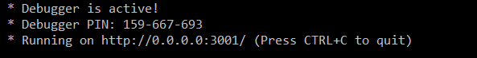
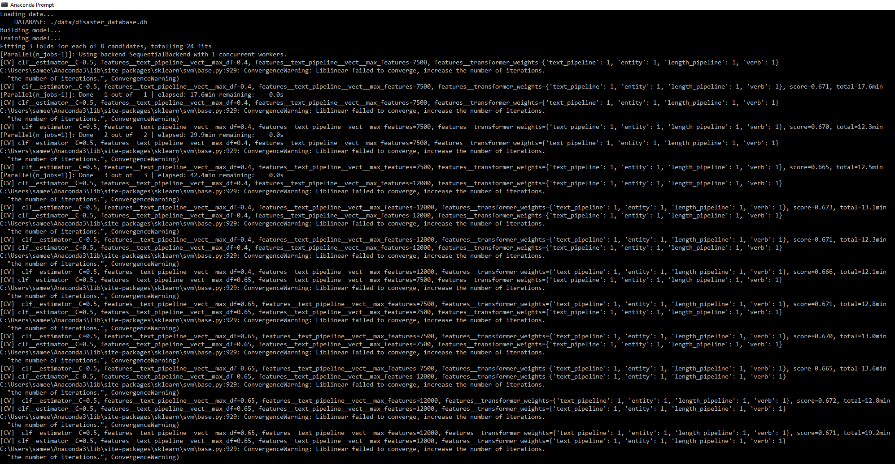
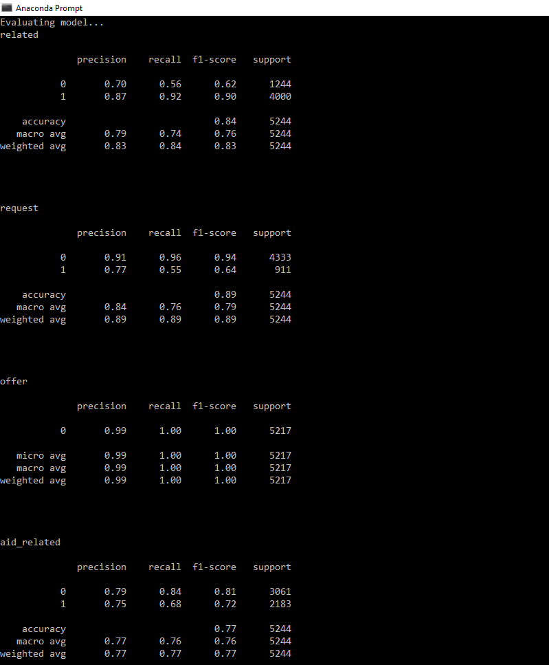
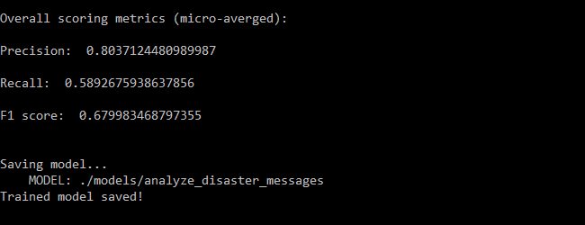
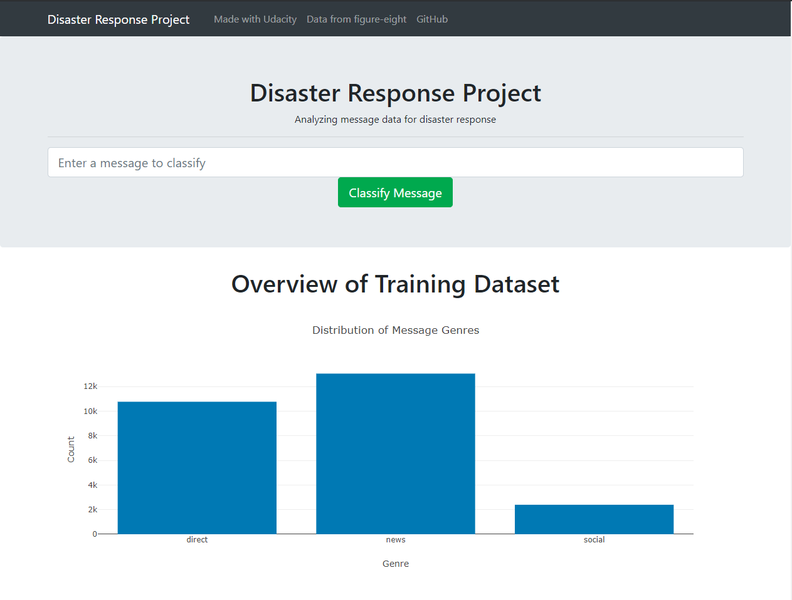

# disaster-messages-classifier

disaster messages classifier is a message classification webapp that categorizes aid related messages under different labels.

Webapp:

[](https://disaster-messages-classifier.herokuapp.com/)

## Motivation

Following a natural disaster, there is a sharp increase in aid related communications in the form of either increased social media 
activity or direct contact with first responders. This usually comes at a time when disaster response professionals have the
least capacity to monitor these communications and filter out aid related messages from the rest. In responding to disasters, 
different organizations address different parts of the problem. For example, one agency would care about water related issues, 
another about food, and yet another about infrastructure. The objective of this project is to use a supervised learning approach
to classify messages into different categories. Labeled message data is provided by [figure eight](https://www.figure-eight.com).

## Installation

These instructions will get you a copy of the project up and running on your local machine for development and testing purposes. See deployment for notes on how to deploy the project on heroku.

### Prerequisites

The following libraries will need to be installed to run the code in Anaconda v4.7.* running python v3.6.* 

```
conda install conda-forge::scikit-learn
conda install conda-forge::matplotlib
conda install conda-forge::nltk
conda install conda-forge::sqlalchemy
conda install conda-forge::cloudpickle
conda install conda-forge::dill
conda install conda-forge::spacy
pip install https://github.com/explosion/spacy-models/releases/download/en_core_web_sm-2.1.0/en_core_web_sm-2.1.0.tar.gz#egg=en_core_web_sm==2.1.0

```

### Installing

Clone the repository

```
git clone https://github.com/sameedakber-ai/disaster-response.git

```


Run the WebApp from the main working directory

```
python app/run.py
```

This will start up the webapp. Go to 'http://127.0.0.1:3001' to access the webapp on your default web browser.


### Advanced installation option
This option is intended for someone looking to reprocess raw data and retraining a classifier. This option is not recommended due to long training times. However, it does help in understanding the code.

After cloning the repository, process and transform raw data into a usable database; pickle database to file

```
python ./data/process_data.py ./data/disaster_messages.csv ./data/disaster_categories.csv ./data/disaster_database.db

```

Train and evaluate classifier on processed data (contained in database) and pickle model to file

```
python ./models/train_classifier.py ./data/disaster_database.db ./models/analyze_disaster_messages

```


Training model...


Evaluating model...


saving model...




Run the WebApp from the main working directory

```
python app/run.py
```


## Deployment

Clone the repository

```
git clone https://github.com/sameedakber-ai/disaster-response.git

```

Install the [necessary packages](#prerequisites)

Setup heroku CLI

Login to heroku

```
heroku login

```

Create a heroku app

```
heroku create your-package-name

```

Commit and push to heroku

```
git add .
git commit -m'your commit message'
git push heroku master

```

## Built With

* [Flask](https://palletsprojects.com/p/flask/) - The web framework used
* [Heroku](https://dashboard.heroku.com) - Cloud Application Platform

## Authors

* **Sameed Akber** - *disaster-response* - [sameedakber-ai](https://github.com/sameedakber-ai)

## License

Copyright 2019 Sameed Akber

Permission is hereby granted, free of charge, to any person obtaining a copy of this software and associated documentation files (the "Software"), to deal in the Software without restriction, including without limitation the rights to use, copy, modify, merge, publish, distribute, sublicense, and/or sell copies of the Software, and to permit persons to whom the Software is furnished to do so, subject to the following conditions:

The above copyright notice and this permission notice shall be included in all copies or substantial portions of the Software.

THE SOFTWARE IS PROVIDED "AS IS", WITHOUT WARRANTY OF ANY KIND, EXPRESS OR IMPLIED, INCLUDING BUT NOT LIMITED TO THE WARRANTIES OF MERCHANTABILITY, FITNESS FOR A PARTICULAR PURPOSE AND NONINFRINGEMENT. IN NO EVENT SHALL THE AUTHORS OR COPYRIGHT HOLDERS BE LIABLE FOR ANY CLAIM, DAMAGES OR OTHER LIABILITY, WHETHER IN AN ACTION OF CONTRACT, TORT OR OTHERWISE, ARISING FROM, OUT OF OR IN CONNECTION WITH THE SOFTWARE OR THE USE OR OTHER DEALINGS IN THE SOFTWARE.

## Acknowledgments

[](https://www.udacity.com)

[](https://www.figure-eight.com)

[](https://dashboard.heroku.com)

